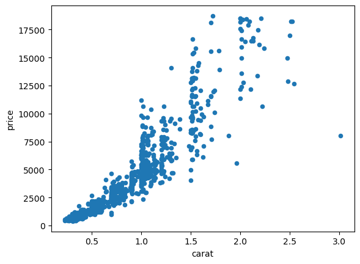

# Multiple Linear Regression - Cumulative Lab

## Introduction

In this cumulative lab you'll perform an end-to-end analysis of a dataset using multiple linear regression.

## Objectives

You will be able to:

* Prepare data for regression analysis using pandas
* Build multiple linear regression models using StatsModels
* Measure regression model performance
* Interpret multiple linear regression coefficients

## Your Task: Develop a Model of Diamond Prices


Photo by <a href="https://unsplash.com/@tahliaclaire?utm_source=unsplash&utm_medium=referral&utm_content=creditCopyText">Tahlia Doyle</a> on <a href="https://unsplash.com/s/photos/diamonds?utm_source=unsplash&utm_medium=referral&utm_content=creditCopyText">Unsplash</a>

### Business Understanding

You've been asked to perform an analysis to see how various factors impact the price of diamonds. There are various [guides online](https://www.diamonds.pro/education/diamond-prices/) that claim to tell consumers how to avoid getting "ripped off", but you've been asked to dig into the data to see whether these claims ring true.

### Data Understanding

We have downloaded a diamonds dataset from [Kaggle](https://www.kaggle.com/datasets/shivam2503/diamonds), which came with this description:

* **price** price in US dollars (\$326--\$18,823)
* **carat** weight of the diamond (0.2--5.01)
* **cut** quality of the cut (Fair, Good, Very Good, Premium, Ideal)
* **color** diamond colour, from J (worst) to D (best)
* **clarity** a measurement of how clear the diamond is (I1 (worst), SI2, SI1, VS2, VS1, VVS2, VVS1, IF (best))
* **x** length in mm (0--10.74)
* **y** width in mm (0--58.9)
* **z** depth in mm (0--31.8)
* **depth** total depth percentage = z / mean(x, y) = 2 * z / (x + y) (43--79)
* **table** width of top of diamond relative to widest point (43--95)

### Requirements

#### 1. Load the Data Using Pandas

#### 2. Build a Baseline Simple Linear Regression Model

#### 3. Evaluate and Interpret Baseline Model Results

#### 4. Prepare a Categorical Feature for Multiple Regression Modeling

#### 5. Build a Multiple Linear Regression Model

#### 6. Evaluate and Interpret Multiple Linear Regression Model Results

## 1. Load the Data Using Pandas

Import `pandas` (with the standard alias `pd`), and load the data from the file `diamonds.csv` into a DataFrame called `diamonds`.

Be sure to specify `index_col=0` to avoid creating an "Unnamed: 0" column.


```python
# Your code here
```


```python
# __SOLUTION__
import pandas as pd
diamonds = pd.read_csv("diamonds.csv", index_col=0)
diamonds
```


<div>
<style scoped>
    .dataframe tbody tr th:only-of-type {
        vertical-align: middle;
    }

    .dataframe tbody tr th {
        vertical-align: top;
    }

    .dataframe thead th {
        text-align: right;
    }
</style>
<table border="1" class="dataframe">
  <thead>
    <tr style="text-align: right;">
      <th></th>
      <th>carat</th>
      <th>cut</th>
      <th>color</th>
      <th>clarity</th>
      <th>depth</th>
      <th>table</th>
      <th>price</th>
      <th>x</th>
      <th>y</th>
      <th>z</th>
    </tr>
  </thead>
  <tbody>
    <tr>
      <th>1</th>
      <td>0.23</td>
      <td>Ideal</td>
      <td>E</td>
      <td>SI2</td>
      <td>61.5</td>
      <td>55.0</td>
      <td>326</td>
      <td>3.95</td>
      <td>3.98</td>
      <td>2.43</td>
    </tr>
    <tr>
      <th>2</th>
      <td>0.21</td>
      <td>Premium</td>
      <td>E</td>
      <td>SI1</td>
      <td>59.8</td>
      <td>61.0</td>
      <td>326</td>
      <td>3.89</td>
      <td>3.84</td>
      <td>2.31</td>
    </tr>
    <tr>
      <th>3</th>
      <td>0.23</td>
      <td>Good</td>
      <td>E</td>
      <td>VS1</td>
      <td>56.9</td>
      <td>65.0</td>
      <td>327</td>
      <td>4.05</td>
      <td>4.07</td>
      <td>2.31</td>
    </tr>
    <tr>
      <th>4</th>
      <td>0.29</td>
      <td>Premium</td>
      <td>I</td>
      <td>VS2</td>
      <td>62.4</td>
      <td>58.0</td>
      <td>334</td>
      <td>4.20</td>
      <td>4.23</td>
      <td>2.63</td>
    </tr>
    <tr>
      <th>5</th>
      <td>0.31</td>
      <td>Good</td>
      <td>J</td>
      <td>SI2</td>
      <td>63.3</td>
      <td>58.0</td>
      <td>335</td>
      <td>4.34</td>
      <td>4.35</td>
      <td>2.75</td>
    </tr>
    <tr>
      <th>...</th>
      <td>...</td>
      <td>...</td>
      <td>...</td>
      <td>...</td>
      <td>...</td>
      <td>...</td>
      <td>...</td>
      <td>...</td>
      <td>...</td>
      <td>...</td>
    </tr>
    <tr>
      <th>53936</th>
      <td>0.72</td>
      <td>Ideal</td>
      <td>D</td>
      <td>SI1</td>
      <td>60.8</td>
      <td>57.0</td>
      <td>2757</td>
      <td>5.75</td>
      <td>5.76</td>
      <td>3.50</td>
    </tr>
    <tr>
      <th>53937</th>
      <td>0.72</td>
      <td>Good</td>
      <td>D</td>
      <td>SI1</td>
      <td>63.1</td>
      <td>55.0</td>
      <td>2757</td>
      <td>5.69</td>
      <td>5.75</td>
      <td>3.61</td>
    </tr>
    <tr>
      <th>53938</th>
      <td>0.70</td>
      <td>Very Good</td>
      <td>D</td>
      <td>SI1</td>
      <td>62.8</td>
      <td>60.0</td>
      <td>2757</td>
      <td>5.66</td>
      <td>5.68</td>
      <td>3.56</td>
    </tr>
    <tr>
      <th>53939</th>
      <td>0.86</td>
      <td>Premium</td>
      <td>H</td>
      <td>SI2</td>
      <td>61.0</td>
      <td>58.0</td>
      <td>2757</td>
      <td>6.15</td>
      <td>6.12</td>
      <td>3.74</td>
    </tr>
    <tr>
      <th>53940</th>
      <td>0.75</td>
      <td>Ideal</td>
      <td>D</td>
      <td>SI2</td>
      <td>62.2</td>
      <td>55.0</td>
      <td>2757</td>
      <td>5.83</td>
      <td>5.87</td>
      <td>3.64</td>
    </tr>
  </tbody>
</table>
<p>53940 rows × 10 columns</p>
</div>


The following code checks that you loaded the data correctly:


```python
# Run this cell without changes

# diamonds should be a dataframe
assert type(diamonds) == pd.DataFrame

# Check that there are the correct number of rows
assert diamonds.shape[0] == 53940

# Check that there are the correct number of columns
# (if this crashes, make sure you specified `index_col=0`)
assert diamonds.shape[1] == 10
```


```python
# __SOLUTION__

# diamonds should be a dataframe
assert type(diamonds) == pd.DataFrame

# Check that there are the correct number of rows
assert diamonds.shape[0] == 53940

# Check that there are the correct number of columns
# (if this crashes, make sure you specified `index_col=0`)
assert diamonds.shape[1] == 10
```

Inspect the distributions of the numeric features:


```python
# Run this cell without changes
diamonds.describe()
```


```python
# __SOLUTION__
diamonds.describe()
```


<div>
<style scoped>
    .dataframe tbody tr th:only-of-type {
        vertical-align: middle;
    }

    .dataframe tbody tr th {
        vertical-align: top;
    }

    .dataframe thead th {
        text-align: right;
    }
</style>
<table border="1" class="dataframe">
  <thead>
    <tr style="text-align: right;">
      <th></th>
      <th>carat</th>
      <th>depth</th>
      <th>table</th>
      <th>price</th>
      <th>x</th>
      <th>y</th>
      <th>z</th>
    </tr>
  </thead>
  <tbody>
    <tr>
      <th>count</th>
      <td>53940.000000</td>
      <td>53940.000000</td>
      <td>53940.000000</td>
      <td>53940.000000</td>
      <td>53940.000000</td>
      <td>53940.000000</td>
      <td>53940.000000</td>
    </tr>
    <tr>
      <th>mean</th>
      <td>0.797940</td>
      <td>61.749405</td>
      <td>57.457184</td>
      <td>3932.799722</td>
      <td>5.731157</td>
      <td>5.734526</td>
      <td>3.538734</td>
    </tr>
    <tr>
      <th>std</th>
      <td>0.474011</td>
      <td>1.432621</td>
      <td>2.234491</td>
      <td>3989.439738</td>
      <td>1.121761</td>
      <td>1.142135</td>
      <td>0.705699</td>
    </tr>
    <tr>
      <th>min</th>
      <td>0.200000</td>
      <td>43.000000</td>
      <td>43.000000</td>
      <td>326.000000</td>
      <td>0.000000</td>
      <td>0.000000</td>
      <td>0.000000</td>
    </tr>
    <tr>
      <th>25%</th>
      <td>0.400000</td>
      <td>61.000000</td>
      <td>56.000000</td>
      <td>950.000000</td>
      <td>4.710000</td>
      <td>4.720000</td>
      <td>2.910000</td>
    </tr>
    <tr>
      <th>50%</th>
      <td>0.700000</td>
      <td>61.800000</td>
      <td>57.000000</td>
      <td>2401.000000</td>
      <td>5.700000</td>
      <td>5.710000</td>
      <td>3.530000</td>
    </tr>
    <tr>
      <th>75%</th>
      <td>1.040000</td>
      <td>62.500000</td>
      <td>59.000000</td>
      <td>5324.250000</td>
      <td>6.540000</td>
      <td>6.540000</td>
      <td>4.040000</td>
    </tr>
    <tr>
      <th>max</th>
      <td>5.010000</td>
      <td>79.000000</td>
      <td>95.000000</td>
      <td>18823.000000</td>
      <td>10.740000</td>
      <td>58.900000</td>
      <td>31.800000</td>
    </tr>
  </tbody>
</table>
</div>


And inspect the value counts for the categorical features:


```python
# Run this cell without changes
categoricals = diamonds.select_dtypes("object")

for col in categoricals:
    print(diamonds[col].value_counts(), "\n")
```


```python
# __SOLUTION__
categoricals = diamonds.select_dtypes("object")

for col in categoricals:
    print(diamonds[col].value_counts(), "\n")
```

    Ideal        21551
    Premium      13791
    Very Good    12082
    Good          4906
    Fair          1610
    Name: cut, dtype: int64 
    
    G    11292
    E     9797
    F     9542
    H     8304
    D     6775
    I     5422
    J     2808
    Name: color, dtype: int64 
    
    SI1     13065
    VS2     12258
    SI2      9194
    VS1      8171
    VVS2     5066
    VVS1     3655
    IF       1790
    I1        741
    Name: clarity, dtype: int64 
    


## 2. Build a Baseline Simple Linear Regression Model

### Identifying a Highly Correlated Predictor

The target variable is `price`. Look at the correlation coefficients for all of the predictor variables to find the one with the highest correlation with `price`.


```python
# Your code here - look at correlations
```


```python
# __SOLUTION__
diamonds.corr()["price"]
```


    carat    0.921591
    depth   -0.010647
    table    0.127134
    price    1.000000
    x        0.884435
    y        0.865421
    z        0.861249
    Name: price, dtype: float64


Identify the name of the predictor column with the strongest correlation below.


```python
# Replace None with appropriate code
most_correlated = None
```


```python
# __SOLUTION__
most_correlated = "carat"
```

The following code checks that you specified a column correctly:


```python
# Run this cell without changes

# most_correlated should be a string
assert type(most_correlated) == str

# most_correlated should be one of the columns other than price
assert most_correlated in diamonds.drop("price", axis=1).columns
```


```python
# __SOLUTION__

# most_correlated should be a string
assert type(most_correlated) == str

# most_correlated should be one of the columns other than price
assert most_correlated in diamonds.drop("price", axis=1).columns
```

### Plotting the Predictor vs. Price

We'll also create a scatter plot of that variable vs. `price`:


```python
# Run this cell without changes

# Plot a sample of 1000 data points, most_correlated vs. price
diamonds.sample(1000, random_state=1).plot.scatter(x=most_correlated, y="price");
```


```python
# __SOLUTION__

# Plot a sample of 1000 data points, most_correlated vs. price
diamonds.sample(1000, random_state=1).plot.scatter(x=most_correlated, y="price");
```


    

    


### Setting Up Variables for Regression

Declare `y` and `X_baseline` variables, where `y` is a Series containing `price` data and `X_baseline` is a DataFrame containing the column with the strongest correlation.


```python
# Replace None with appropriate code
y = None
X_baseline = None
```


```python
# __SOLUTION__
y = diamonds["price"]
X_baseline = diamonds[[most_correlated]]
```

The following code checks that you created valid `y` and `X_baseline` variables:


```python
# Run this code without changes

# y should be a series
assert type(y) == pd.Series

# y should contain about 54k rows
assert y.shape == (53940,)

# X_baseline should be a DataFrame
assert type(X_baseline) == pd.DataFrame

# X_baseline should contain the same number of rows as y
assert X_baseline.shape[0] == y.shape[0]

# X_baseline should have 1 column
assert X_baseline.shape[1] == 1
```


```python
# __SOLUTION__

# y should be a series
assert type(y) == pd.Series

# y should contain about 54k rows
assert y.shape == (53940,)

# X_baseline should be a DataFrame
assert type(X_baseline) == pd.DataFrame

# X_baseline should contain the same number of rows as y
assert X_baseline.shape[0] == y.shape[0]

# X_baseline should have 1 column
assert X_baseline.shape[1] == 1
```

### Creating and Fitting Simple Linear Regression

The following code uses your variables to build and fit a simple linear regression.


```python
# Run this cell without changes
import statsmodels.api as sm

baseline_model = sm.OLS(y, sm.add_constant(X_baseline))
baseline_results = baseline_model.fit()
```


```python
# __SOLUTION__
import statsmodels.api as sm

baseline_model = sm.OLS(y, sm.add_constant(X_baseline))
baseline_results = baseline_model.fit()
```

## 3. Evaluate and Interpret Baseline Model Results

Write any necessary code to evaluate the model performance overall and interpret its coefficients.


```python
# Your code here
```


```python
# __SOLUTION__
print(baseline_results.summary())
```

                                OLS Regression Results                            
    ==============================================================================
    Dep. Variable:                  price   R-squared:                       0.849
    Model:                            OLS   Adj. R-squared:                  0.849
    Method:                 Least Squares   F-statistic:                 3.041e+05
    Date:                Fri, 13 May 2022   Prob (F-statistic):               0.00
    Time:                        18:55:23   Log-Likelihood:            -4.7273e+05
    No. Observations:               53940   AIC:                         9.455e+05
    Df Residuals:                   53938   BIC:                         9.455e+05
    Df Model:                           1                                         
    Covariance Type:            nonrobust                                         
    ==============================================================================
                     coef    std err          t      P>|t|      [0.025      0.975]
    ------------------------------------------------------------------------------
    const      -2256.3606     13.055   -172.830      0.000   -2281.949   -2230.772
    carat       7756.4256     14.067    551.408      0.000    7728.855    7783.996
    ==============================================================================
    Omnibus:                    14025.341   Durbin-Watson:                   0.986
    Prob(Omnibus):                  0.000   Jarque-Bera (JB):           153030.525
    Skew:                           0.939   Prob(JB):                         0.00
    Kurtosis:                      11.035   Cond. No.                         3.65
    ==============================================================================
    
    Notes:
    [1] Standard Errors assume that the covariance matrix of the errors is correctly specified.


```python
# __SOLUTION__
from sklearn.metrics import mean_absolute_error

baseline_mae = mean_absolute_error(y, baseline_results.predict(sm.add_constant(X_baseline)))
baseline_mae
```


    1007.4632473569848


Then summarize your findings below:


```python
# Your written answer here
```

<details>
    <summary style="cursor: pointer"><b>Solution (click to expand)</b></summary>

`carat` was the attribute most strongly correlated with `price`, therefore our model is describing this relationship.

Overall this model is statistically significant and explains about 85% of the variance in price. In a typical prediction, the model is off by about &dollar;1k.

* The intercept is at about -\\$2.3k. This means that a zero-carat diamond would sell for -\\$2.3k.
* The coefficient for `carat` is about \\$7.8k. This means for each additional carat, the diamond costs about \\$7.8k more.

</details>    


```python

```
